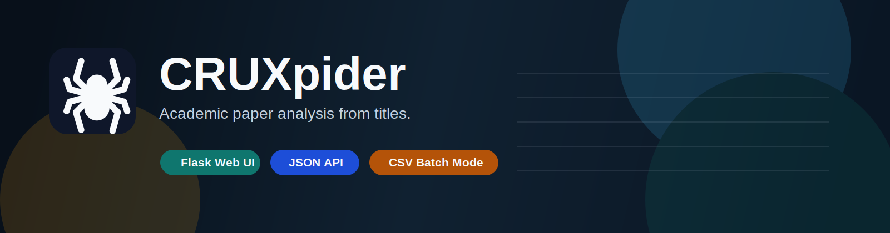

<p align="center">
  
</p>

<p align="center">
  <a href="./LICENSE"></a>
  
  
  
</p>

# CRUXpider

Academic paper analysis from titles, with multi-source paper resolution, confidence scoring, public-info-first dataset discovery, related-paper ranking, and ranked code discovery for reproducibility workflows.

## Highlights

- `Single paper analysis`: multi-source title resolution, venue, PDF, categories, confidence, identifiers, and ranked code candidates
- `Dataset discovery`: public-info-first candidates from DataCite, Crossref, OpenAlex, plus heuristic text extraction
- `Related papers`: Semantic Scholar + OpenAlex ranking pipeline with explanations from venue, year, topic, method, author, and citation signals, plus grouped research-navigation views
- `CSV batch mode`: title list in, enriched CSV out
- `Web UI + JSON API`: simple to use locally or extend in other tooling
- `Graceful degradation`: keeps working when external sources are incomplete
- `Contributor-friendly`: one local bootstrap path and one Docker path
- `Fast repeat queries`: in-process TTL cache for repeated lookups

## Data Sources

- `arXiv`
  Primary source for title lookup, categories, and PDF links.
- `OpenAlex`
  Source for venue metadata, related works, and topic signals.
- `Semantic Scholar`
  Source for title match confirmation, citation signals, and recommendations.
- `Crossref`
  Source for DOI-oriented bibliographic enrichment and public dataset metadata search.
- `DataCite`
  Source for public dataset DOI metadata and related-identifier evidence.
- `GitHub API`
  Source for ranked repository discovery when paper-to-code metadata is unavailable.

## Papers with Code Status

As of March 17, 2026, requests to `https://paperswithcode.com/api/v1/...` redirect to [Hugging Face Papers](https://huggingface.co/papers/trending). For CRUXpider, that means the legacy Papers with Code API is no longer treated as a reliable machine API.

Instead of failing hard, CRUXpider now:

- detects the redirect,
- reports source status through the API,
- falls back to GitHub repository search links.

This keeps the tool usable even though the old integration path has effectively disappeared.

## Quick Start

### 1. One-click local startup

```bash
./start.sh
```

This command:

- creates `.venv` if needed
- installs dependencies
- runs the test suite
- starts the Flask app on port `5003`

Open [http://127.0.0.1:5003](http://127.0.0.1:5003).

### 2. Configure environment variables

```bash
cp .env.example .env
```

Set values as needed:

```bash
CRUXPIDER_HOST=0.0.0.0
CRUXPIDER_PORT=5003
CRUXPIDER_SECRET_KEY=change-me
PYALEX_EMAIL=your_email@example.com
CROSSREF_MAILTO=your_email@example.com
SEMANTIC_SCHOLAR_API_KEY=
GITHUB_TOKEN=
CRUXPIDER_REQUEST_TIMEOUT=12
CRUXPIDER_MAX_BATCH_SIZE=50
CRUXPIDER_RESULT_CACHE_TTL=900
```

`PYALEX_EMAIL` is recommended because OpenAlex behaves better when requests include a contact email.
`CROSSREF_MAILTO` is recommended for polite Crossref usage.
`GITHUB_TOKEN` and `SEMANTIC_SCHOLAR_API_KEY` are optional but improve rate limits.
`CRUXPIDER_RESULT_CACHE_TTL` controls the in-process cache lifetime for repeated queries.

### 3. Docker startup

```bash
docker compose up --build
```

This is the supported container path for contributors who do not want a local Python setup.

## API Overview

### Endpoints

- `POST /api/search_paper`
- `POST /api/find_relevant_papers`
- `POST /api/batch_process`
- `GET /api/status`
- `GET /api/health`

### Example request

```bash
curl -X POST http://127.0.0.1:5003/api/search_paper \
  -H "Content-Type: application/json" \
  -d '{"title": "Attention Is All You Need"}'
```

### Example response shape

```json
{
  "query_title": "Attention Is All You Need",
  "title": "Attention Is All You Need",
  "journal_conference": "NeurIPS",
  "pdf_url": "https://arxiv.org/pdf/1706.03762.pdf",
  "categories": ["cs.CL", "cs.LG"],
  "ai_related": "YES",
  "datasets": [
    {
      "name": "WMT",
      "source": "datacite",
      "score": 0.81,
      "evidence": ["Public metadata links this dataset to the paper."]
    }
  ],
  "dataset_candidates": [],
  "methods": ["transformer"],
  "confidence": 0.99,
  "matched_sources": ["arxiv", "semantic_scholar"],
  "identifiers": {
    "arxiv": "1706.03762",
    "semantic_scholar": "204e3073870fae3d05bcbc2f6a8e263d9b72e776"
  },
  "repository_url": "https://github.com/jadore801120/attention-is-all-you-need-pytorch",
  "repository_candidates": [],
  "warnings": []
}
```

Related-paper responses now include `score`, `signal_count`, `sources`, short `reasons`, and grouped views such as `same_author`, `same_method`, `same_wave`, and `strong_follow_up`.

Dataset responses now prefer public metadata over pure text guessing. CRUXpider queries public scholarly metadata from DataCite, Crossref, and OpenAlex first, then fills gaps with title/abstract/topic heuristics.

## Running Tests

```bash
python -m unittest discover -s tests -v
```

The current test suite focuses on route-level behavior and response contracts for the main Flask API. `./start.sh` runs this suite before booting the app unless `CRUXPIDER_SKIP_TESTS=1` is set.

For repeated interactive use, CRUXpider keeps a short-lived in-process cache. This significantly reduces latency when you rerun the same title search while exploring the UI locally.

## Project Structure

```text
CRUXpider/
├── app.py                  # Main Flask application
├── cruxpider_engine.py     # Multi-source resolution and ranking engine
├── app_integrated.py       # Compatibility entrypoint
├── CRUXpider.py            # Legacy CLI-oriented logic
├── config.py               # Environment-driven settings
├── templates/              # HTML templates
├── static/                 # Frontend assets
├── tests/                  # Route-level tests
└── requirements.txt
```

## Design Notes

- `Simple deployment`
  The app is intentionally lightweight and can run through `./start.sh`, behind Gunicorn, or in Docker.
- `Open-source safe defaults`
  Secrets are environment-based, and local artifacts are excluded by `.gitignore`.
- `Research workflow first`
  The UX is optimized around entering titles and getting actionable metadata back quickly.
- `Latency-aware`
  Multi-source fetches run in parallel, and repeated lookups reuse a TTL cache.
- `Open collaboration`
  External contributors can work through forks and pull requests; see [CONTRIBUTING.md](/Users/anthonyche/Desktop/CRUXpider/CONTRIBUTING.md).

## Known Limitations

- Paper title matching is still heuristic and depends on external metadata quality.
- Dataset discovery prefers public metadata and public abstract/title text, but it still cannot guarantee a complete paper-to-dataset mapping.
- Repository discovery is ranked GitHub evidence, not a guaranteed paper-to-code ground truth mapping.
- Some fields may still be empty when upstream APIs omit abstracts or structured metadata.

## Roadmap

- Improve title matching and ranking quality.
- Improve method and dataset extraction with stronger scientific parsers.
- Add stronger repository verification beyond GitHub evidence ranking.
- Add persistent caching and request metrics.
- Add screenshot/demo assets for the repository homepage.

## Release

For the first public release checklist, see [PUBLISH_CHECKLIST.md](/Users/anthonyche/Desktop/CRUXpider/PUBLISH_CHECKLIST.md).

For the GitHub release draft, see [GITHUB_RELEASE_v0.1.0.md](/Users/anthonyche/Desktop/CRUXpider/GITHUB_RELEASE_v0.1.0.md).

## License

This project is released under the MIT License. See [LICENSE](/Users/anthonyche/Desktop/CRUXpider/LICENSE).
